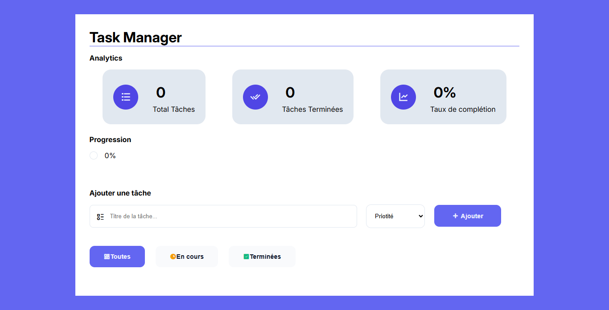

# Gestionnaire de tâches

Application web de gestion de tâches développée dans le cadre de la **Semaine 8 — Objets, Tableaux & Méthodes** de l’**Akieni Academy**.

L'objectif du projet est de mettre en pratique la manipulation des **objets et tableaux JavaScript**, ainsi que les méthodes `map()`, `filter()` et `reduce()`, à travers une petite application interactive de gestion de tâches.

---

## Objectifs

L'application permet à l'utilisateur de :

- Ajouter une tâche avec un titre et une priorité.
- Attribuer une priorité à chaque tâche :
  - **Haute**
  - **Moyenne**
  - **Basse**

- Marquer une tâche comme terminée.
- Supprimer une tâche.
- Filtrer les tâches :
  - Toutes
  - En cours
  - Terminées

- Consulter automatiquement les statistiques :
  - Nombre total de tâches.
  - Nombre de tâches terminées.
  - Taux de complétion.

- Visualiser la progression à l'aide d'une barre de progression.

---

## Aperçu du projet

### Version Desktop



### Version Mobile


---

## Compétences JavaScript travaillées

Ce projet permet de pratiquer :

- Les objets JavaScript.
- Les tableaux d'objets.
- Les fonctions.
- La manipulation du DOM.
- `map()`
- `filter()`
- `reduce()`
- La recherche et la manipulation d'un élément par son identifiant.
- La génération dynamique du HTML.
- La gestion des événements avec `addEventListener()`.
- La mise à jour dynamique des statistiques.

---

## Fonctionnement

L'application repose sur un tableau contenant les différentes tâches.

Chaque tâche est représentée sous forme d'objet :

```js
{
  id: 1,
  titre: "Apprendre JavaScript",
  priorite: "haute",
  terminee: false
}
```

Lorsqu'un utilisateur saisit une tâche :

```text
Saisie du titre
      ↓
Choix de la priorité
      ↓
Clic sur "Ajouter"
      ↓
Création de l'objet tâche
      ↓
Ajout dans le tableau
      ↓
Affichage de la liste
      ↓
Mise à jour des statistiques
```

Les tâches ne sont donc pas pré-enregistrées : elles sont **créées dynamiquement à partir des saisies de l'utilisateur**.

---

## Tableau de bord

Le tableau de bord affiche trois indicateurs principaux :

| Indicateur         | Description                     |
| ------------------ | ------------------------------- |
| Total              | Nombre total de tâches          |
| Terminées          | Nombre de tâches terminées      |
| Taux de complétion | Pourcentage de tâches terminées |

Une barre de progression permet également de visualiser le taux de complétion.

---

## Design et responsive

Le projet a été développé selon une approche **Mobile First**.

La conception commence donc par l'affichage sur les petits écrans, puis s'adapte progressivement aux écrans plus larges grâce aux media queries.

### Responsive

- **Mobile** : affichage sur une colonne.
- **Tablette** : adaptation progressive des espaces et composants.
- **Desktop** : utilisation de plusieurs colonnes pour les statistiques.

### CSS utilisé

- Flexbox
- Media queries
- Variables CSS
- Transitions
- Design responsive
- Approche Mobile First

---

## Priorités

Les priorités sont représentées visuellement par différentes couleurs :

- **Haute** : priorité importante.
- **Moyenne** : priorité intermédiaire.
- **Basse** : priorité faible.

Lorsqu'une tâche est terminée, son titre est affiché avec :

- `text-decoration: line-through`
- une opacité réduite.

---

## Structure du projet

```text
task__manager/
│
├── README.md
├── index.html
├── .gitignore
│
└── assets/
    │
    ├── css/
    │   └── style.css
    │
    ├── js/
    │   └── tache.js
    │
    └── images/
        ├── desktop.jpg
        └── mobile.jpg
```

### `index.html`

Contient la structure de l'application :

- Header
- Cartes KPI
- Barre de progression
- Formulaire d'ajout
- Filtres
- Liste des tâches

### `assets/css/style.css`

Contient :

- Le design de l'application.
- Les couleurs.
- Les cartes.
- Les priorités.
- La progression.
- Le responsive Mobile First.
- Les media queries.

### `assets/js/tache.js`

Contient toute la logique JavaScript :

- Gestion du tableau de tâches.
- Ajout.
- Suppression.
- Modification du statut.
- Filtrage.
- Calcul des statistiques.
- Affichage dynamique.

### `assets/images/`

Contient les captures d'écran utilisées dans le README :

- `desktop.jpg` : aperçu de la version desktop.
- `mobile.jpg` : aperçu de la version mobile.

---

## Utilisation

1. Ouvrir `index.html` dans un navigateur.
2. Saisir le nom d'une tâche.
3. Choisir sa priorité.
4. Cliquer sur **Ajouter**.
5. Utiliser les boutons d'action pour terminer ou supprimer une tâche.
6. Utiliser les filtres pour afficher les tâches souhaitées.

---

## Contraintes du projet

Le projet respecte les exigences du livrable **Gestionnaire de tâches — Semaine 8** de l'Akieni Academy.

Les fonctionnalités principales sont réalisées en **JavaScript fondamental**, sans framework JavaScript.

---

## Technologies utilisées

- HTML5
- CSS3
- JavaScript
- Git
- GitHub

---

## Auteur

**Kwon Gee Lukelo Prosper**

Projet réalisé dans le cadre de l'**Akieni Academy — Cohorte 02**.

---

> Projet réalisé dans une démarche d'apprentissage et de mise en pratique de JavaScript à travers une application interactive et responsive.
